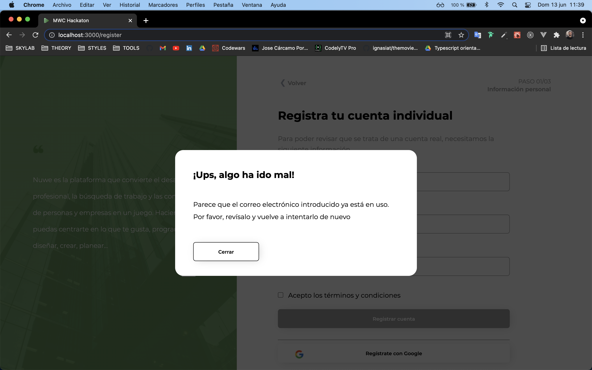

# MWC HACKATON

This project was created with [React](https://es.reactjs.org/).

## Hosting

You can see the page in [https://mwc-hackaton.vercel.app/](https://mwc-hackaton.vercel.app/)

## Available Scripts

In the project directory, you can run:

### `yarn start or npm start`

Runs the app in the development mode.\
Open [http://localhost:3000](http://localhost:3000) to view it in the browser.

The page will reload if you make edits.\
You will also see any lint errors in the console.

### `yarn test or npm test`

Launches the test runner in the interactive watch mode.\
See the section about [running tests](https://facebook.github.io/create-react-app/docs/running-tests) for more information.

## Project images

